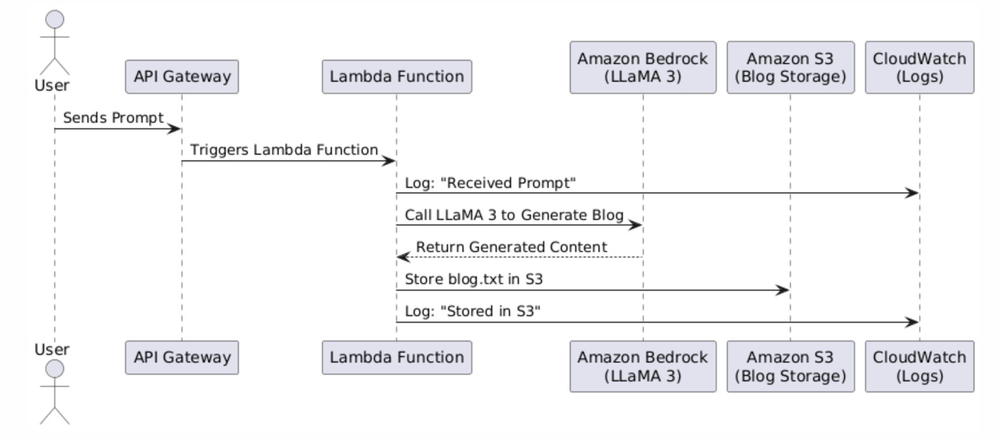
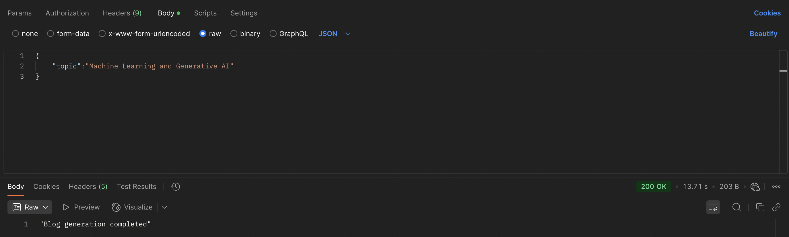

# 📝 Blog Generator using AWS Lambda, Bedrock, and S3

A fully serverless blog generation system built using AWS. This project uses Amazon Bedrock's Meta LLaMA 3 model to generate blog content based on a prompt received via an API Gateway POST request. The response is stored in an S3 bucket as a `.txt` file. CloudWatch is used to monitor logs and errors, and Postman was used for API testing.

---

## 📌 Features

- 🔁 End-to-end serverless architecture
- 🤖 AI-powered blog content via Amazon Bedrock (Meta LLaMA 3)
- 📥 Prompts received through API Gateway (POST method)
- 📂 Generated content saved in Amazon S3 as `.txt` files
- 🧾 CloudWatch for logs and error tracking
- 🔐 IAM configuration for permission handling
- 🧪 Postman used for API testing

---

## 🛠️ AWS Services Used

| Service             | Purpose                                                   |
|---------------------|-----------------------------------------------------------|
| **AWS Lambda**      | Executes the blog generation logic                        |
| **Amazon Bedrock**  | Invokes the Meta LLaMA 3 model to generate content        |
| **Amazon S3**       | Stores generated blogs as `.txt` files                    |
| **Amazon CloudWatch**| Monitors logs and errors during execution                |
| **Amazon API Gateway** | Exposes the Lambda function as an HTTP POST endpoint  |
| **IAM Role**        | Permissions via AdministratorAccess for Lambda (POC)      |
| **Postman**         | API testing interface                                     |

---

## ⚙️ Project Flow 


## 🧪 API Usage (via Postman)

### Endpoint
```http
POST https://<your-api-id>.execute-api.<region>.amazonaws.com/<stage>/api-topic
```


## Result (AWS CloudWatch)


## 🚀 Future Improvements

- Add **Streamlit** or **React** frontend for better user interaction
- Save blog metadata (e.g., author, timestamp) in **DynamoDB**
- Use **EventBridge** to schedule automated blog creation
- Add **user authentication** to control who can trigger blog generation
- Implement **prompt logging** to track user requests and generated content

## 🛡️ License

This project is licensed under the [MIT License](LICENSE). Feel free to use, modify, and share with attribution.

---
## 📢 Connect with Me

Let's collaborate! Connect with me on:

[](https://www.linkedin.com/in/v-rithul-06b5632b6/)  

🚀 **Happy Coding!**
